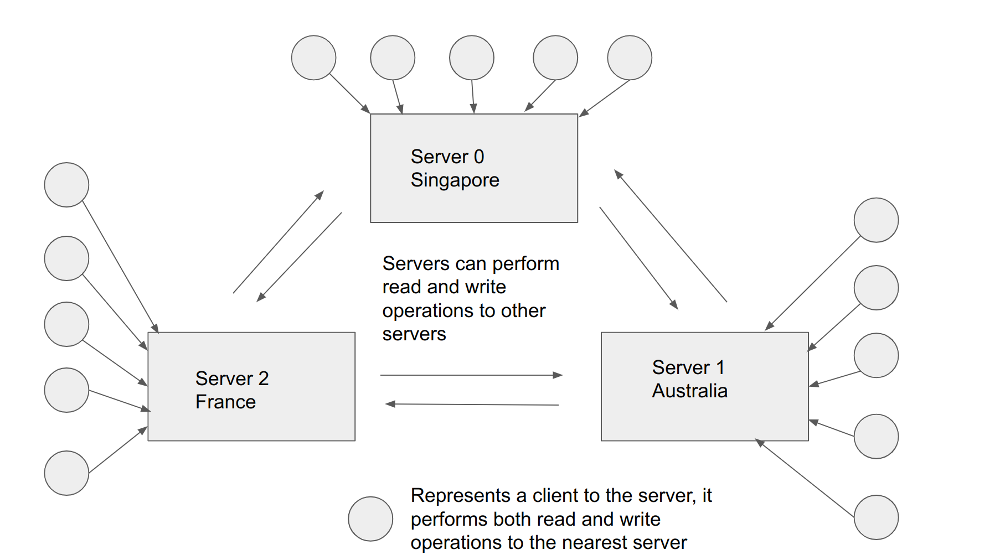
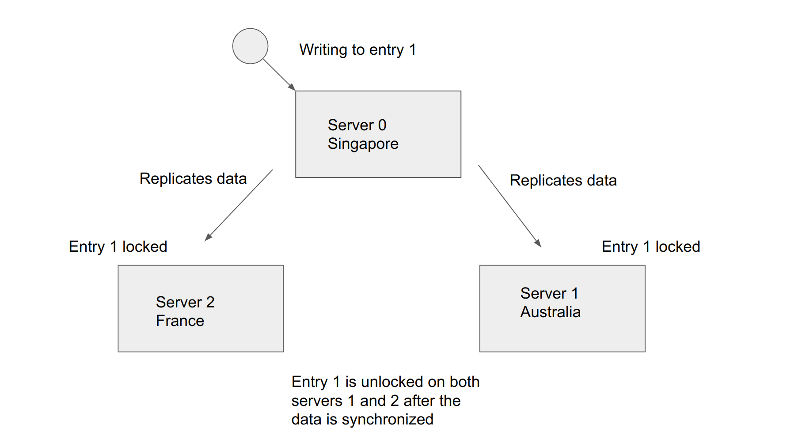
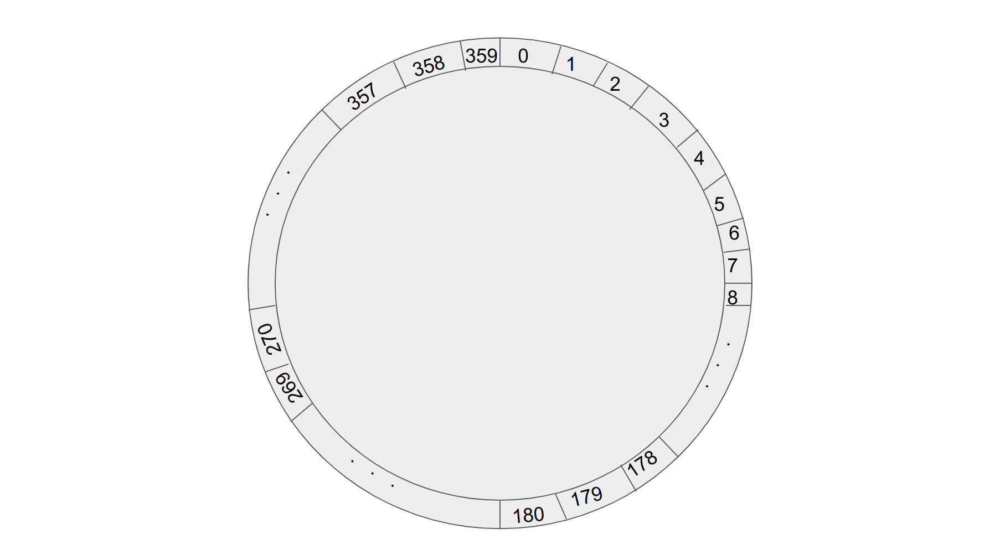
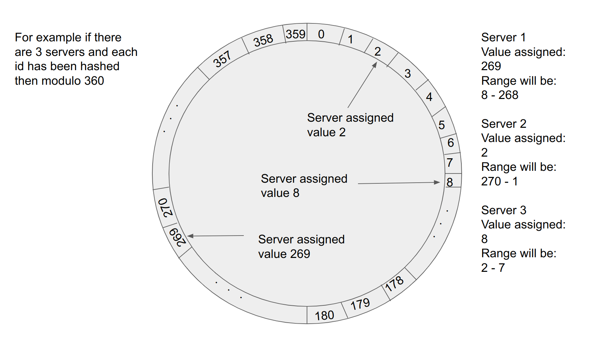
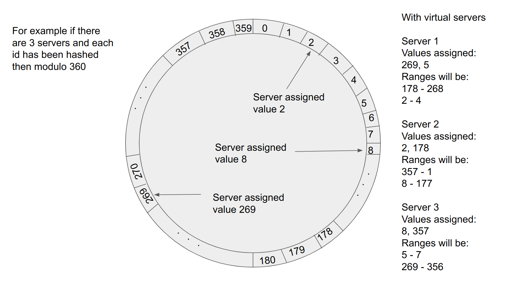

# Two ways to sync data across a distributed system

## Multi-master replication
One have, all have.

Put simply whenever there is write operation to one server, the same write operation will be replicated to all the other servers.

When there is a read operation performed, it will be done on the server that is nearest to where the read operation is called.

One possible risk is that there may be conflicting data write operations. For example if one server is writing to the same entry as another server.

One way to prevent conflicting data write operations is to lock the object that is being written to. This means that when one server is writing to one entry, all other servers cannot write to that entry. So before the write operation is done, a lock operation is performed first. When the write operation is completed, the object is unlocked and other servers can write to that entry.

The benefit of using this method to sync data read and write is that if one server fails, the data is still available in all other servers.

One problem with using this method is that scale up is slow. This is because when adding a new server, it has to completely copy all previous data from the other servers.

Another problem with this method is that because the write operation is done to all servers, it may slow the system down as each server has to do every write operation in the system.

## Consistent hashing
Each have ranges.

Put simply, each server is randomly assigned a random range of values that it is responsible for.

Consistent hashing distributes the data evenly among servers because data is randomly assigned to each server. Hashing of ids and keys is how the data is randomly assigned.

First a range of possible values is created. For example there are 360 possible values. Data that is entered into the system will fall into only one of the possible values. This is called a hash ring.

The range of possible values is called a hash ring because when servers are assigned a random range of values, this random range of values will be assigned to the server with assigned value nearest to it in a clockwise manner.

Data is assigned a value it falls under by hashing the key to the data. A modulo operation is then performed on the hashed key to find the value that the data is assigned to.

Servers are assigned a range of values by hashing the id of the server. A modulo operation is then performed on the hashed id to find the range of values that are assigned to the server.

Consistent hashing is excellent for load balancing because in general due to values being randomly assigned to servers, the servers would have an equal load.

One possible problem is that there are too few servers and due to the range of values being randomly assigned, the load is not actually balanced as one server may cover a far wider range of values than other servers.

The way to overcome the problem above is to create "virtual" servers where more than one range of values is assigned to each server. This can be achieved by using a "different" hash function to assign a server another range of values. For example, server id 1 can be assigned the hashed of "1.1", "1.2", "1.3" each modulo 360. Thus assigning it multiple ranges.

Another benefit of consistent hashing is that it can withstand frequent scale ups and scale downs without the need to perform major data migration.

For example if a server x is assigned a range from 4-20. And a new server y is added that is assigned the range 4-10. The only data migration that needs to happend is from the server x to server y of the values 4-10. For all other servers, there is no change. It is the same for if server y were to be removed, only values 4-10 needs to be migrated to server x.